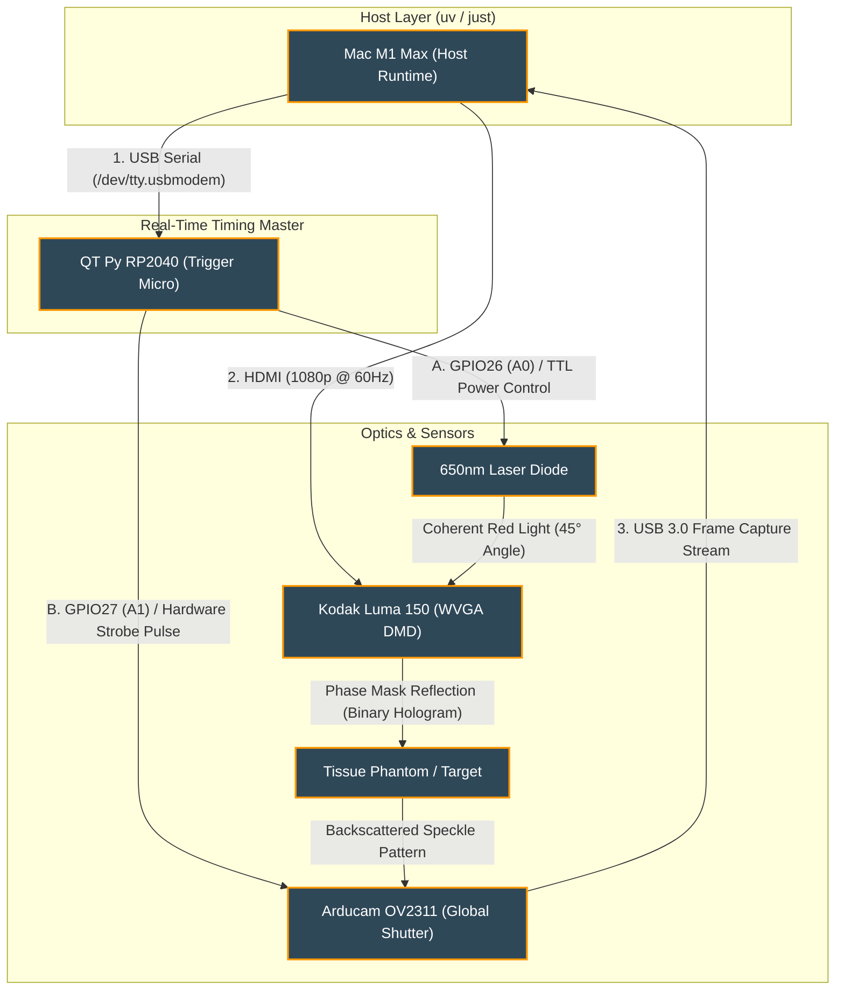

# Speckler

This project takes a laser and shines it into an occluded substrate attempting to focus a laser deeper 
via machine learning and digital micromirror devices.


## Speckler Version 1 

### Introduction
This project is a sub $1000 example for building a Biophotonics device that penetrates
a tissue phantom (such as a gelatin slide) via Lee Holography using a Digital Micromirror
Device and 650nm laser. 

### Setup


See full parts list in [EQUIPMENT_V1](./EQUIPMENT_V1.md). 

TODO: add photo

### Results


---


## V2
See [EQUIPMENT_V2.md](./EQUIPMENT_V2.md) for a parts list.
V2 will use a RF wideband amplifier paired with a low noise amp
and an oscilloscope. The low noise amp will be placed directly on 
the synthetic dermal tissue on the same side that the laser enters.
The laser causes tiny sound waves that the low noise amp picks up,
sends to the oscilloscope, and then is used as the training signal.

### TODO

Images & Write Up of Lab Setup

Code:
```
hardware/
- camera
- controller
- dmd

calculations/
- lee_hologram
- phase_retrieval
- signal_to_enhancement
- speckle

tests/

training/
```